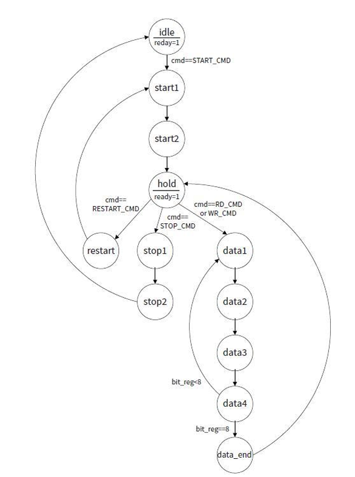
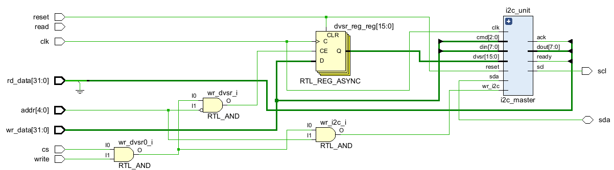

### Examen Final Emprendimiento, Innovacion y Proyectos

Para este examen lo que se pide es diseñar un driver de I2C basados en el libro del doctor chu, realizar las simulaciones necesarias, hacer la comunicacion con cualquier tipo de dispositivo que tenga comunicacion i2c, realizar un cambio personalizado a este driver y por ultimo diseñar nuestro primer ASIC utilizando la plantilla de TinyTapeout

## 1 Driver I2C
Para poder realizar el driver de I2C nos centramos en realizarlo en 2 partes.
### I2C Master
Primero realizamos lo que es el archivo [I2C_Master.sv](I2C/I2C.srcs/sources_1/new/i2c_master.sv) el cual es módulo que es el encargado de manejar la comunicación directa con el bus I2C. Implementa el protocolo I2C que incluye la generación de señales de reloj (scl), la transmisión y recepción de datos (sda), y las condiciones de inicio (start) y parada (stop).

Para maneja la comunicación I2C lo hace a través de una máquina de estados finita (FSM). Acontinuacion una descripcion del flujo basado en la siguiente imagen:

 ** 1 Idle: **
El módulo está en espera hasta que se recibe un comando de inicio (START_CMD).
La señal ready está activa en este estado, indicando que el módulo está listo para recibir un comando.

** 2 Start: **
La FSM genera una condición de inicio (START) en el bus I2C. Esto implica colocar la línea sda en bajo mientras scl está en alto, seguido de colocar scl en bajo.

** 3 Hold: **
Preparado para la próxima operación. La FSM espera recibir un comando para proceder con una operación de lectura/escritura o generar una condición de reinicio (RESTART_CMD) o parada (STOP_CMD).

** 4 Data Transfer: **
Dependiendo del comando (cmd), la FSM entra en los estados de transferencia de datos (data1 a data4). Aquí, se manejan la transmisión y recepción de datos a través de la línea sda.
Durante la escritura, se envían los bits de datos uno por uno.
Durante la lectura, se reciben los bits de datos desde el dispositivo esclavo.

** 5 Data End: **
Después de completar la transferencia de datos (8 bits de datos + 1 bit de ACK/NACK), la FSM pasa al estado data_end para indicar la finalización de la transferencia de datos.

** 6 Restart: **
Genera una condición de reinicio en el bus I2C.

** 7 Stop: **
Genera una condición de parada (STOP) en el bus I2C.

** 8 Done Tick: **
Indica la finalización de la operación actual.

Este módulo está diseñado para manejar múltiples operaciones I2C (inicio, lectura, escritura, reinicio, parada) de manera secuencial mediante el uso de una FSM.

---Segundo realizamos el archivo [I2C_Core](I2C/I2C.srcs/sources_1/new/i2c_core.sv)

Este proporciona una interfaz de alto nivel para manejar las comunicaciones I2C utilizando el controlador i2c_master, permitiendo una fácil integración y control desde otros componentes del sistema.

Con estos dos archivos ya tenemos lo necesario par aconstruir el core de nuestra comunicacion I2C, quedando este como lo siguiente:

